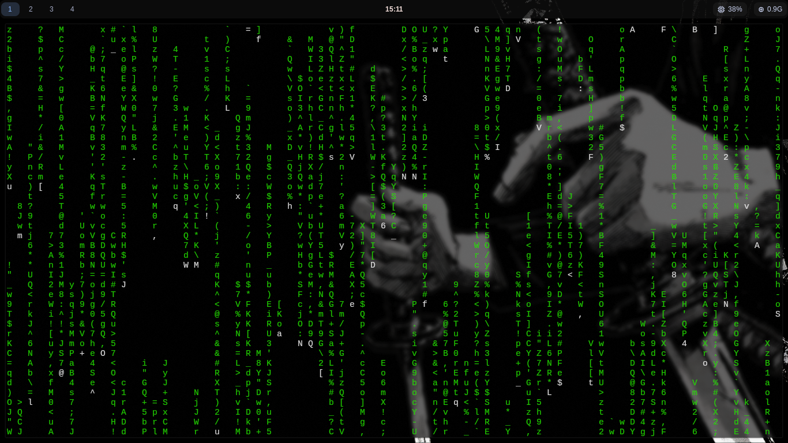
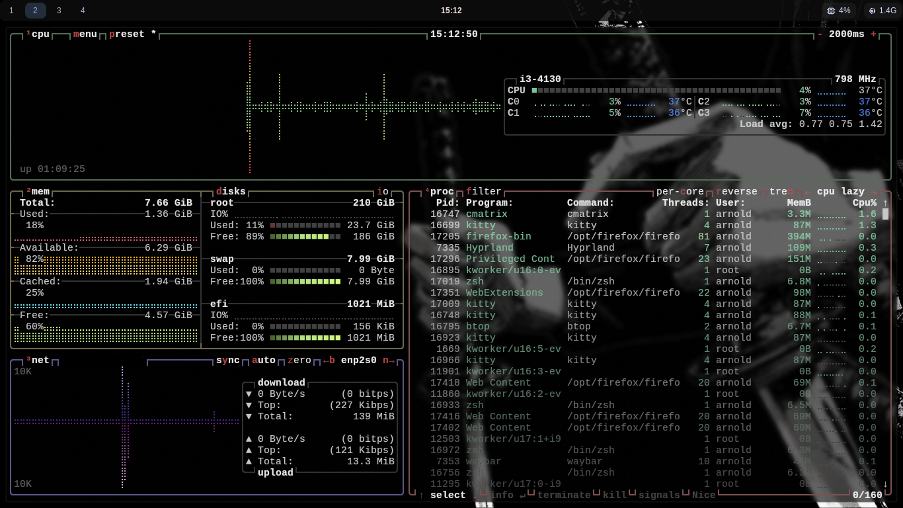
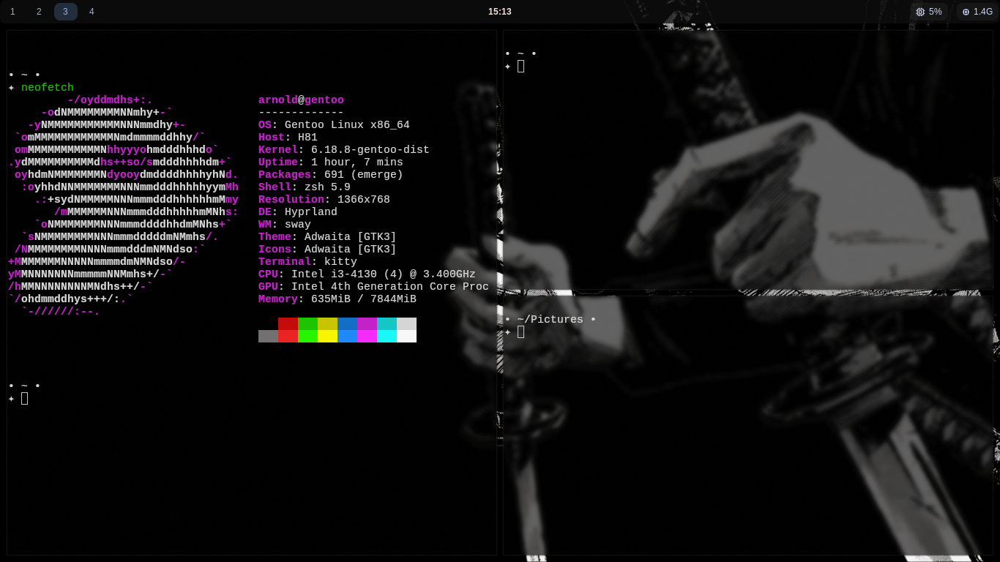
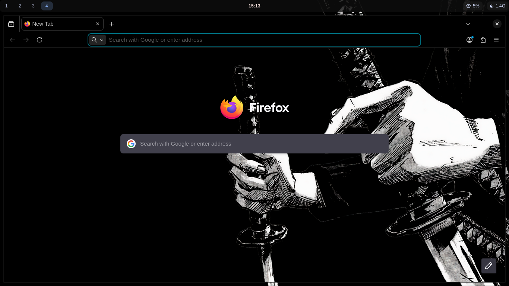
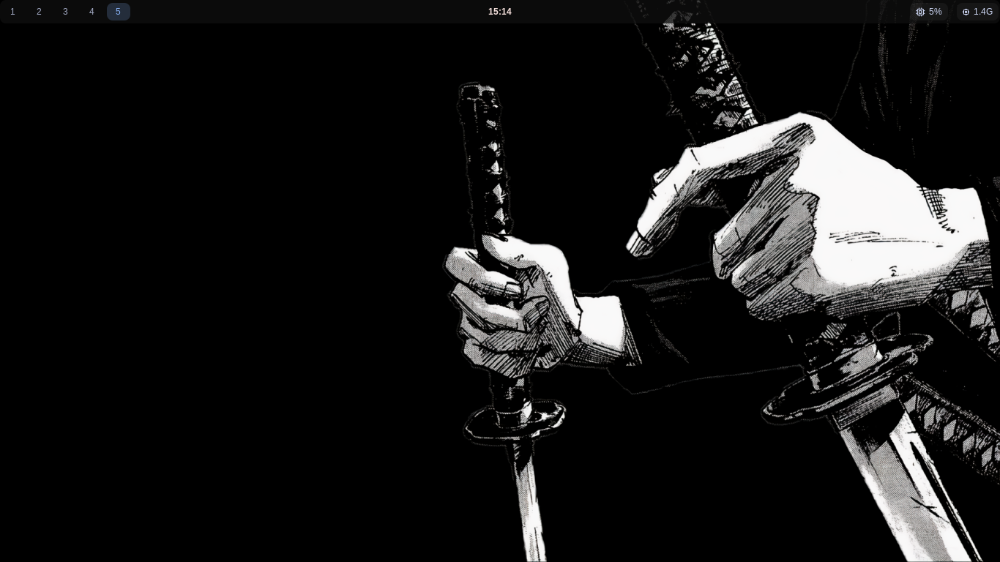

# Gentoo Hyprland Dotfiles

Minimal black & white Hyprland rice on Gentoo Linux.

> Clean. Fast. Minimal.

---

## Preview

### Matrix


### System Monitor (btop)


### Neofetch + Tiling


### Firefox Theme


### Desktop


---

## System

| Component | Name |
|---------|------|
| OS | Gentoo Linux |
| WM | Hyprland |
| Terminal | Kitty |
| Bar | Waybar |
| Launcher | Wofi |
| Shell | Zsh |
| Browser | Firefox |
| GTK Theme | Adwaita |
| Icons | Adwaita |

---

## Structure

```
.
├── hypr
├── kitty
├── waybar
├── wofi
├── gtk-3.0
└── assets
```

---

## Installation

Clone repo

```
git clone https://github.com/arnoxldq/Gentoo-Dotfiles.git
cd Gentoo-Dotfiles
```

Install GNU stow

Gentoo:
```
emerge app-admin/stow
```

Apply configs

```
stow hypr kitty waybar wofi gtk-3.0
```

---

## Features

- Minimal black & white theme
- Fast Hyprland config
- Clean Waybar
- Lightweight setup
- Matrix terminal aesthetic

---

## Requirements

- hyprland
- kitty
- waybar
- wofi
- zsh
- nerd fonts
- stow

---

## Author

arnold

GitHub:
https://github.com/arnoxldq

